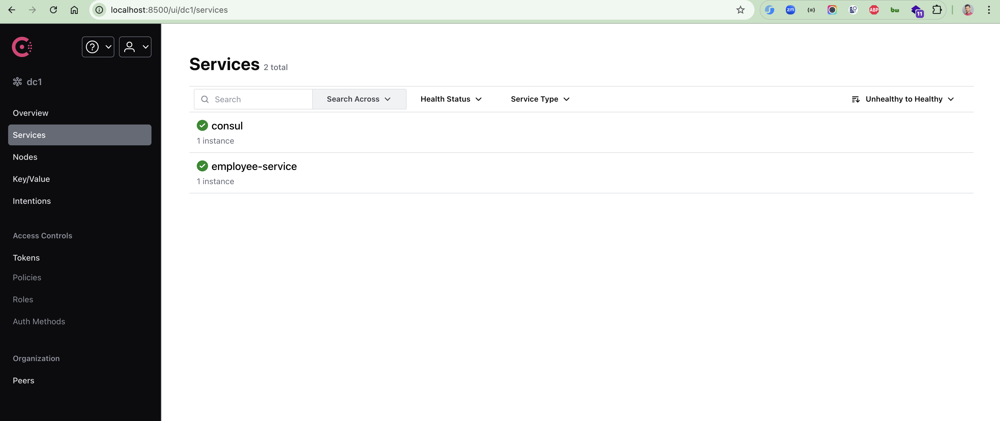
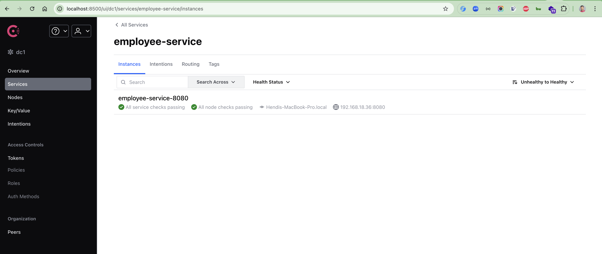
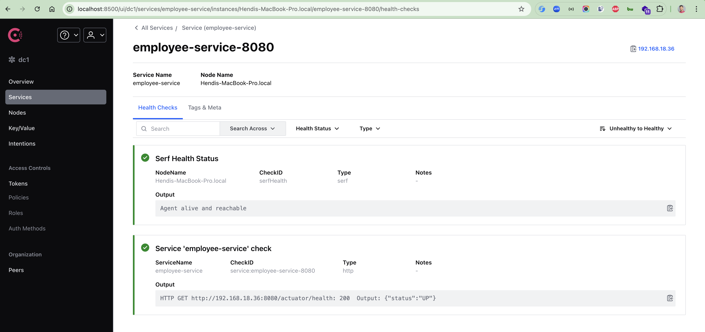

# spring-boot-consul

### Things to do list

1. Clone this repository: `git clone https://github.com/hendisantika/spring-boot-consul.git`
2. Navigate to the folder: `cd spring-boot-consul`
3. Make sure your consul server already up
4. Run the application: `gradle clean bootRun`
5. Open your favorite browser: http://localhost:8500

### Image Screenshot

Consul Home Page

Consul Service Page

Consul Details Service Page

